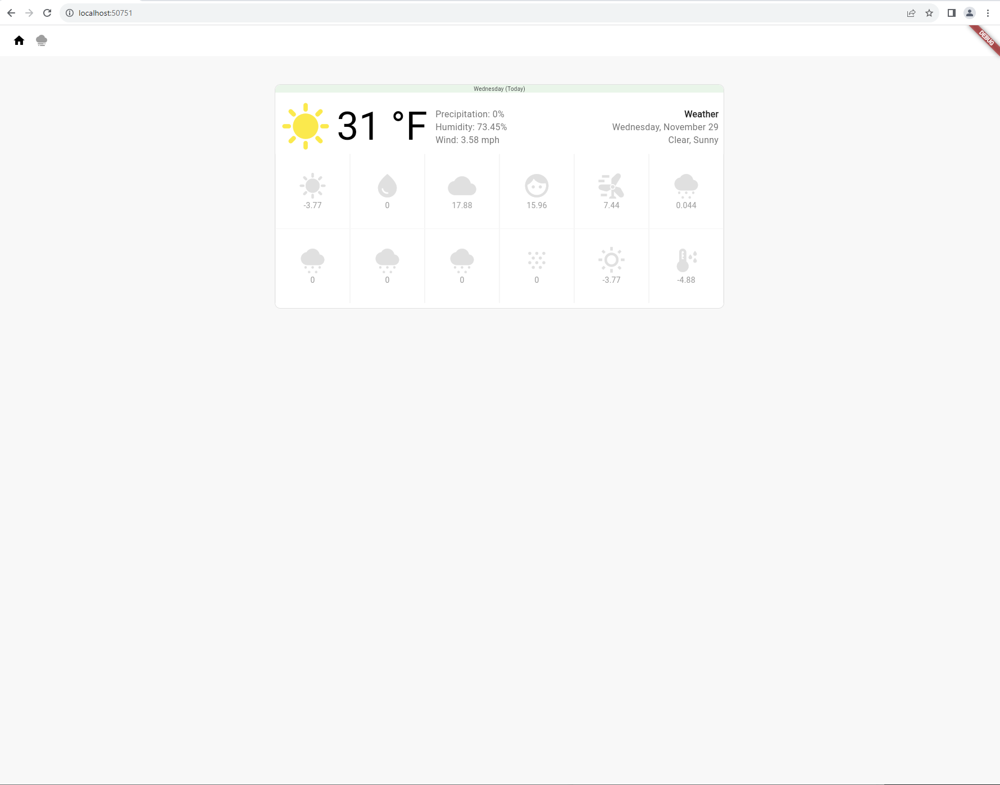

# Weather Forecast App

This is a simple Flutter applicaiton that displays weather data. It utilizes 
the [tomorrow.io](https://app.tomorrow.io/home) API to display up-to-date 
weather data. Ensure you plug-in a working API Key into `config.dart` (`API_KEY`).



## Installation:

If you do not have Flutter (or Dart) - you may follow the instructions on 
these pages:

<ul>
  <li><a href="https://docs.flutter.dev/get-started/install/linux">Linux Installation</a></li>
  <li><a href="https://docs.flutter.dev/get-started/install/macos">MacOS Installation</a></li>
  <li><a href="https://docs.flutter.dev/get-started/install/chromeos">ChromeOS Installation</a></li>
  <li><a href="https://docs.flutter.dev/get-started/install/windows">Windows Installation</a></li>
</ul>

## Build instructions:
```bash
# Change directory to the weather_app directory (this is where the application
# is stored)
cd weather_app

# Get packages.
flutter pub get

# Run the hot-reload-enabled flutter application.
# Chrome is recommended as the connected device.
flutter run
```

## Application configuration variables available

Here are some of the custom in-app variables and settings you may adjust.

<b>Remember to set your tomorrow.io API key!</b>

```dart
# API_KEY MUST BE SET for this application to work.
# If you do not yet have an API key - easily create one at:
# https://app.tomorrow.io
static final String API_KEY = '{PASTE_YOUR_API_KEY_HERE}';

# DATA_FETCH_METHOD is the fetch method used. Options: state, latlon, local
# local is an optional local jsonserver (see other directories).
static final String DATA_FETCH_METHOD = 'state';
static final String MAIN_STATE = 'minnesota';
static final double MAIN_LAT = 42;
static final double MAIN_LON = -71;
```

## Miscellaneous Notes:

This application was bootstrapped with: `flutter create weather_app` <br/>(development 
was focused on just the <b>Chrome Device</b>. Other devices may not work.)

Here are some helpful Flutter commands just on-case you have some errors:

Ensure you are using the correct [Flutter channel](https://github.com/flutter/flutter/wiki/Flutter-build-release-channels)
```bash
flutter channel master
flutter upgrade
```