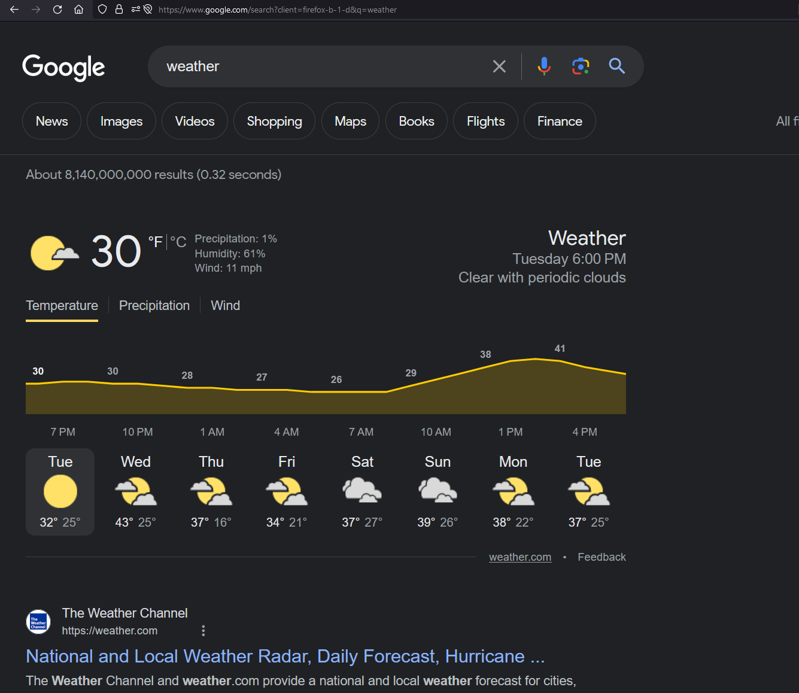
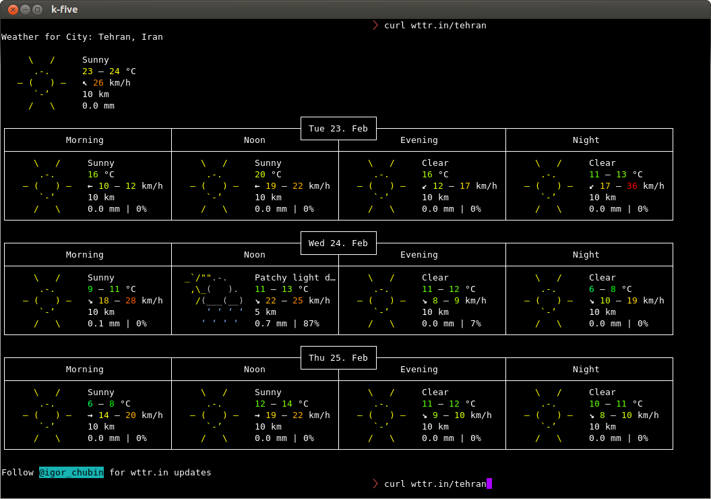
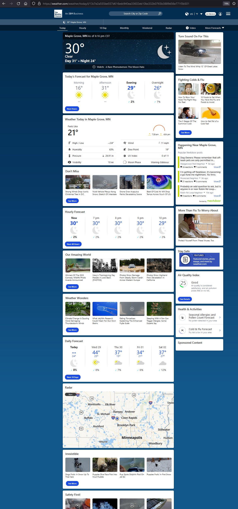
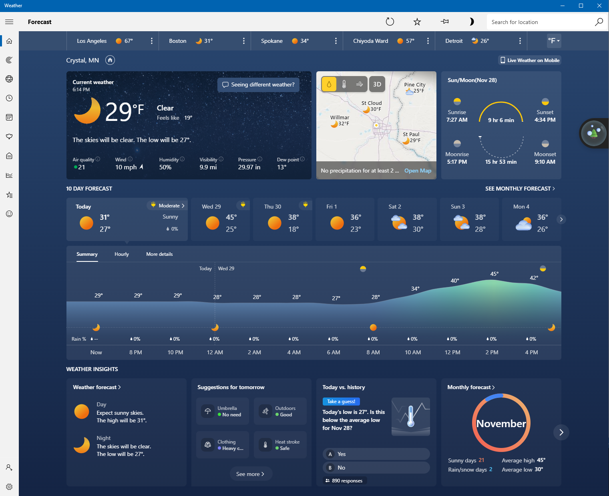

# Miscellaneous notes on some of the reference images.

## google_search_weather.png (file://referenceimages/google_search_weather.png)

I like this image. When I want to see the temperature quickly, I like having
it in large, clear text.

## terminal_weather_view.png (file://referenceimages/terminal_weather_view.png)

Information displayed in the terminal is awesome. I like this view as well! It 
is very functional and is a great example of working within ASCII-only 
constraints.

## weather_com_today.png (file://referenceimages/weather_com_today.png)

Again, it is very nice to have the <b>primary information</b> large and at the 
top. Mobile and small-screen users will love that. Being able to quickly get 
what you need super fast is important!

## windows_weather_app.png (file://referenceimages/windows_weather_app.png)

The windows application is clean. I do enjoy having a little bit of extra UI 
to click on and ponder at (especially when the weather outside is getting 
dangerous!).

## Conclusion

Here are some key points I think worked well:

<ul>
  <li>Clean, clear numbers (especially today - keep this at the front!)</li>
  <li>Don't overcrowd the page. Maintain a clear focus-point for the user.</li>
  <li>Don't be afraid to get colorful! I thought the more colorful ones 
  were very home-like.</li>
</ul>